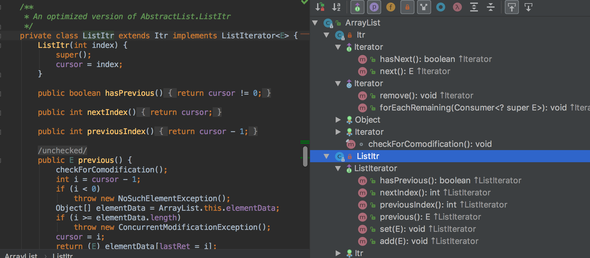

## List

```java
public interface List<E> extends Collection<E> {}
```

可以将元素维护在特定的序列。继承自Collection接口。

### List和Set

```java
public interface Set<E> extends Collection<E> {}
public class LinkedHashSet<E> extends HashSet<E>
    implements Set<E>, Cloneable, java.io.Serializable {}
public class TreeSet<E> extends AbstractSet<E>
    implements NavigableSet<E>, Cloneable, java.io.Serializable {}
```

都是继承自Collection。但是Set中存储的元素没有重复，所以加入Set的元素需要定义equal 方法保证对象的唯一性。Set接口不保证维护元素的次序，但是不意味 Set 就是无序的。

例如，LinkedHashSet 是按照元素插入顺序保存元素，TreeSet 按照compareTo的实现排序。

### List的几种实现

常见的几种实现:

- ArrayList，相当于不定长数组。随机访问快，插入和删除慢。

- LinkedList，相当于链表。随机访问慢，插入和删除快。

- CopyOnWriteArrayList，线程安全的ArrayList。

  - > 写入将导致创建整个底层数组的副本，而原数组保留在原地，将使得复制的数组在被修改时，读取操作可以安全的执行，修改完成后，一个原子操作将把新的数组换入 -- 《think in java th4》 21.9.2 小节

- vector，线程安全的可变数组。java 1.0 的容器，现在已经过时，不应该使用。在底层数组容量不足时，ArrayList会将容量扩容为原来的1.5倍。而Vector支持在创建的时候主动声明扩容时增加的容量的大小，通过`Vector(int initialCapacity, int capacityIncrement)` 构造函数实现。如果没有声明，或者capacityIncrement <= 0，那么默认扩容为原来的2倍。

### Collections.synchronizedList()

Collections类里的静态工具方法。可以将不安全的 List 转为安全的 List。

看一下源代码：

```java
public static <T> List<T> synchronizedList(List<T> list) {
    return (list instanceof RandomAccess ?
            new SynchronizedRandomAccessList<>(list) :
            new SynchronizedList<>(list));
}

static <T> List<T> synchronizedList(List<T> list, Object mutex) {
    return (list instanceof RandomAccess ?
            new SynchronizedRandomAccessList<>(list, mutex) :
            new SynchronizedList<>(list, mutex));
}
static class SynchronizedList<E>
    extends SynchronizedCollection<E>
    implements List<E> {
    private static final long serialVersionUID = -7754090372962971524L;

    final List<E> list;
    SynchronizedList(List<E> list) {
        super(list);
        this.list = list;
    }
    SynchronizedList(List<E> list, Object mutex) {
        super(list, mutex);
        this.list = list;
    }
    public boolean equals(Object o) {
        if (this == o)
            return true;
        synchronized (mutex) {return list.equals(o);}
    }
    public int hashCode() {
        synchronized (mutex) {return list.hashCode();}
    }
}
//...
```

可以看到 `SynchronizedList<E> `只是对 List 做了一层封装，内部用 `synchronized (mutex)` 来同步，这个加锁的对象mutex可以从构造函数传入。如果不传入的话，则 `mutex = this`，即锁对象为该 list 。

```java
static class SynchronizedCollection<E> implements Collection<E>, Serializable {
    private static final long serialVersionUID = 3053995032091335093L;

    final Collection<E> c;  // Backing Collection
    final Object mutex;     // Object on which to synchronize
    SynchronizedCollection(Collection<E> c) {
        this.c = Objects.requireNonNull(c);
        mutex = this;
    }
    SynchronizedCollection(Collection<E> c, Object mutex) {
        this.c = Objects.requireNonNull(c);
        this.mutex = Objects.requireNonNull(mutex);
    }
}
```

而Vector 的 `synchronized` 关键字都是加在方法上的，所以 锁的对象是list对象。

另外，如下代码所示，`SynchronizedList` 中不是所有的方法里都用了同步代码块，迭代器就没有，所以迭代的时候需要手动同步。而 Vector 对应的方法是加了锁的。

```java
static class SynchronizedList<E>
        extends SynchronizedCollection<E>
        implements List<E> {
    public ListIterator<E> listIterator() {
        return list.listIterator(); // Must be manually synched by user
    }

    public ListIterator<E> listIterator(int index) {
        return list.listIterator(index); // Must be manually synched by user
    }
    // ...
}
```


使用迭代器进行遍历的时候需要另外注意。看下以下的代码。

```java
public class FailFast {
    static List<Integer> list = Collections.synchronizedList(new ArrayList<>());
    // static List<Integer> list = new Vector<>();

    public static void main(String[] args) {

        for (int i = 0; i < 1000; i++) {
            list.add(i);
        }

        runIteratorThread();
        runUpdateThread();

        System.out.println(list);
    }

    static void runUpdateThread() {
        new Thread(() -> {
            for (int i = 1000; i < 2000; i++) {
                list.add(i);
            }
        }).start();
    }

    static void runIteratorThread() {
        new Thread(() -> {
            Iterator<Integer> iter = list.iterator();
            while (iter.hasNext()) {
                System.out.println(iter.next());
            }
        }).start();
    }
}
```

运行会抛出异常  `ConcurrentModificationException` ，这是因为 fast-fail 机制，runIteratorThread 中的线程在遍历的同时，runUpdateThread 又修改了线程，所以在 runIteratorThread 中迭代的时候就抛出异常了。这里使用 Vector 和 synchronizedList 结果都是一样的。因为这里主要的问题是 fast-fail，所以遍历的时候不能修改，所以需要对整个遍历部分的代码块加锁，应改成如下:

```java
static void runUpdateThread() {
    new Thread(() -> {
        synchronized (list) {
            for (int i = 1000; i < 2000; i++) {
                list.add(i);
            }
        }
    }).start();
}

static void runIteratorThread() {
    new Thread(() -> {
        synchronized (list) {
            // 注意以下这行应当放在同步块内。
            // 因为如果放在外面，这个线程先获取了 iter 对象，然后因为没获取到锁而开始等待，等到获取到锁的时候，可能iter对象已经变了？
            Iterator<Integer> iter = list.iterator();
            while (iter.hasNext()) {
                System.out.println(iter.next());
            }
        }
    }).start();
}
```


对`Collections.synchronizedList`  对象调用 iterator 的过程：SynchronizedList 类没有实现 iterator方法，调用父类 SynchronizedCollection 的 iterator方法，而 SynchronizedCollection 的 iterator 方法则是直接调用 传给 Collections.synchronizedList的对应的 iterator 对象。


那么 synchronizedList 和 vector 的区别？还是不太清楚。

...


那么总结一下区别：

1. Collections.synchronizedList()  的扩展机制不同，比如如果是 arrayList，扩容时变为原来的1.5倍。而Vector变为2倍。（这个应该算是 ArrayList 和 Vector的区别）
2. Collections.synchronizedList() 可以指定加锁的对象，默认是this。Vector则只能是 this。
3. // 使用SynchronizedList的时候，进行遍历时要手动进行同步处理。 

### Arrays.asList()

Arrays类里的静态工具方法。

```java
public static <T> List<T> asList(T... a) {
	return new ArrayList<>(a);
}
```

注意这里的 ArrayList 是Arrays 的一个内部类，不是 java.util.ArrayList，提供了 size、toArray、get、set、indexOf、contains 方法，但是没有实现 add和remove方法，所以无法增加和删除，即长度不可变。其add方法直接继承自抽象类 AbstractList，直接调用会直接抛出异常。

```java
public void add(int index, E element) {
    throw new UnsupportedOperationException();
}
```


以如下代码为例：

```java
Integer a[] = new Integer[10];
List<Integer> b = new ArrayList<>(Arrays.asList(a));
```

因为 Arrays.asList() 接受的是泛型参数，所以传入的数组应该用包装类型。

Arrays.asList()  创建的不可变长的List 再传给 java.util.ArrayList 的构造函数，创建一个新的ArrayList。

### fail-fast和fail-safe

#### fail-fast 快速报错

java容器的保护机制，能够防止多个进程/线程同时修改同一个容器的内容。

```java
// 《think in java th4》 17.11.3 小节
public class FailFast {
    public static void main(String[] args) {
        Collection<String> c = new ArrayList<String>();
        Iterator<String> it = c.iterator();
        c.add("An object");
        try {
            String s = it.next();
        } catch(ConcurrentModificationException e) {
            System.out.println(e);
        }
    }
} /* Output:
java.util.ConcurrentModificationException
*///:~
```

如上代码，在获取迭代器后，又添加元素，可能会导致状态不一致，所以就会抛出异常。

##### fail-fast 检测机制

迭代器在遍历过程中是直接访问内部数据的，因此内部的数据在遍历的过程中无法被修改。为了保证不被修改，迭代器内部维护了一个标记 “mode” ，当集合结构改变（添加删除或者修改），标记"mode"会被修改，而迭代器每次的hasNext()和next()方法都会检查该"mode"是否被改变，当检测到被修改时，抛出ConcurrentModificationException

```java
private class Itr implements Iterator<E> {
    int cursor;       // index of next element to return
    int lastRet = -1; // index of last element returned; -1 if no such
    int expectedModCount = modCount;

    public boolean hasNext() {
        return cursor != size;
    }
    public E next() {
        checkForComodification();
        //...
    }
    public void remove() {
        if (lastRet < 0)
            throw new IllegalStateException();
        checkForComodification();
		//...
    }
    final void checkForComodification() {
        if (modCount != expectedModCount)
            throw new ConcurrentModificationException();
    }
}
```

#### fail-safe

对集合结构的修改都会在一个复制的集合上进行修改，因此不会抛出ConcurrentModificationException

fail-safe机制有两个问题

1. 需要复制集合，产生大量的无效对象，开销大。

2. 无法保证读取的数据是目前原始数据结构中的数据。

如 ConcurrentHashMap, CopyOnWriteArrayList, CopyOnWriteArraySet 等等是满足 fail-safe的。

```java
public class FailSafe {
    public static void main(String[] args) {
        Collection<String> c = new CopyOnWriteArrayList<>();

        c.add("An object1");
        c.add("An object2");
        Iterator<String> it = c.iterator();
        try {
            c.add("An object3");
            while (it.hasNext()) {
                System.out.println(it.next());
            }
        } catch(ConcurrentModificationException e) {
            System.out.println(e);
        } finally {
            System.out.println(c);
        }
    }
}
/*
Output:
An object1
An object2
[An object1, An object2, An object3]
*/
```

简单的记忆一下：fail-fast是不允许同时读写，fail-safe 是允许同时读写。

### 遍历的同时删除ArrayList中的元素

```java
ArrayList<String> list = new ArrayList<>();
list.add("1");
list.add("2");
list.add("3");
list.add("4");

Iterator<String> iter = list.iterator();
while (iter.hasNext()) {
    String s = iter.next();
    if (s.equals("2")) {
        iter.remove();
    }
}
System.out.println(list);
// [1, 3, 4]
```

```java
public Iterator<E> iterator() {
    return new Itr();
}
private class Itr implements Iterator<E> {
    int cursor;       // index of next element to return
    int lastRet = -1; // index of last element returned; -1 if no such
    int expectedModCount = modCount;

    public void remove() {
        if (lastRet < 0)
            throw new IllegalStateException();
        checkForComodification();

        try {
            ArrayList.this.remove(lastRet);
            cursor = lastRet;
            lastRet = -1;
            expectedModCount = modCount;
        } catch (IndexOutOfBoundsException ex) {
            throw new ConcurrentModificationException();
        }
    }
    //...
}
```

如上代码所示，`iter.remove()` 内部调用了 List 的 remove 方法，同时移动了 cursor，为了之后能够正常继续往后迭代。同时， 修改标记 `expectedModCount = modCount;`，这样之后迭代的时候 `checkForComodification`就不会抛出异常。


### ListIterator 和 Iterator

如下图所示，ListIterator 继承自 Iterator，并且实现了 ListIterator 接口 ，所以 ListIterator 也就比 Iterator 多了一些方法。



## 参考

- https://docs.oracle.com/javase/8/docs/api/?java/util/Collection.html
- https://www.jianshu.com/p/a20052ac48f1
- http://wiki.jikexueyuan.com/project/java-enhancement/java-thirtysix.html
- https://blog.csdn.net/ch717828/article/details/46892051
- http://www.hollischuang.com/archives/498
- https://www.codejava.net/java-core/collections/understanding-collections-and-thread-safety-in-java

