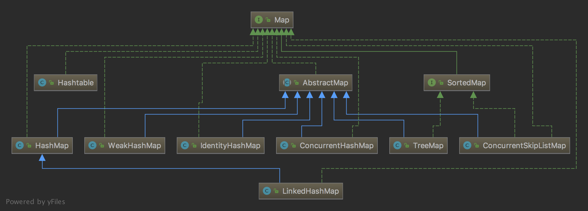

## Map

### Map 分类



HashMap 是非线程安全的。

LinkedHashMap 是 HashMap 的一个子类，它保留插入的顺序。

HashTable 是线程安全的。

ConcurrentHashMap 也是线程安全的，在加锁粒度上比HashTable要细，性能会更好一些。

ConcurrentSkipListMap

在4线程1.6万数据的条件下，ConcurrentHashMap 存取速度是ConcurrentSkipListMap 的4倍左右。

但ConcurrentSkipListMap有几个ConcurrentHashMap 不能比拟的优点：

1、ConcurrentSkipListMap 的key是有序的。

2、ConcurrentSkipListMap 支持更高的并发。ConcurrentSkipListMap 的存取时间是log（N），和线程数几乎无关。也就是说在数据量一定的情况下，并发的线程越多，ConcurrentSkipListMap越能体现出他的优势。 

- https://blog.csdn.net/guangcigeyun/article/details/8278349

### Map遍历

#### for each循环

##### 1. Map.entrySet() 同时遍历key和value

```java
Map<Integer, Integer> map = new HashMap<>();
map.put(1, 1);
for (Map.Entry<Integer, Integer> entry : map.entrySet()) {
    System.out.println("Key = " + entry.getKey() + ", Value = " + entry.getValue());
}
```

以上For each语法编译后其实生成的是

```java
Iterator var2 = map.entrySet().iterator();
while(var2.hasNext()) {
    Entry<Integer, Integer> entry = (Entry)var2.next();
    System.out.println("Key = " + entry.getKey() + ", Value = " + entry.getValue());
}
```

##### 2. keySet()遍历key

```java
for (Integer key : map.keySet()) {
    System.out.println("Key = " + key);
}
```

##### 3. values遍历value

```java
for (Integer value : map.values()) {
    System.out.println("Value = " + value);
}
```

##### 4. forEach

Map.entrySet()  的一种简化写法，内部还是用的方式1来遍历

```java
map.forEach((k, v) -> System.out.println("Key = " + k + ", Value = " + v));
```

##### 5. 通过keySet找到键后再去找值

```java
for (Integer key : map.keySet()) {
    Integer value = map.get(key);
    System.out.println("Key = " + key + ", Value = " + value);
}
```

#### While循环（Iterator）

注意Map不是Collection，所以不能直接用Iterator，但是 map.entrySet() 返回的是 Set 集合，所以就可以用了。

这种的好处是可以通过iterator.remove 来删除。

```java
Iterator<Map.Entry<Integer, Integer>> entries = map.entrySet().iterator();
while (entries.hasNext()) {
    Map.Entry<Integer, Integer> entry = entries.next();
    System.out.println("Key = " + entry.getKey() + ", Value = " + entry.getValue());
}
```

不适用泛型

```java
Iterator entries = map.entrySet().iterator();
while (entries.hasNext()) {
    Map.Entry entry = (Map.Entry) entries.next();
    Integer key = (Integer) entry.getKey();
    Integer value = (Integer) entry.getValue();
    System.out.println("Key = " + key + ", Value = " + value);
}
```

总结一下，

map.forEach 方法 内部用的 是for-each loop `for (Map.Entry<K, V> entry : entrySet())` ，

而 for-each loop 编译后会变为使用 `while (entries.hasNext()) `

https://www.geeksforgeeks.org/iterate-map-java/

### HashMap

以下代码基于 JDK8

图片来自 http://wiki.jikexueyuan.com/project/java-collection/hashmap.html


如图，HashMap 底层就是一个数组结构，数组中的每一项又是一个链表。因为hash过程会有hash值重复，如果hash值重复了，就放到链表后面存着。

```java
// 定义底层数组，第一次使用的时候才会初始化。长度总是2的幂次（为了方便后面计算桶）。
transient Node<K,V>[] table;
// 定义链表节点Node
static class Node<K,V> implements Map.Entry<K,V> {
    final int hash;
    final K key;
    V value;
    Node<K,V> next;
    //...
}
// 插入操作
public V put(K key, V value) {
    return putVal(hash(key), key, value, false, true);
}
// 计算hash值，>>> 无符号右移，忽略符号位，空位都以0补齐‘
// 这样计算hash值有什么特别的意义吗？
static final int hash(Object key) {
    int h;
    return (key == null) ? 0 : (h = key.hashCode()) ^ (h >>> 16);
}
final V putVal(int hash, K key, V value, boolean onlyIfAbsent,
               boolean evict) {
    Node<K,V>[] tab; Node<K,V> p; int n, i;
    // 第一次执行插入操作时，判断 table 为null 才进行初始化。
    if ((tab = table) == null || (n = tab.length) == 0)
        // 调用 resize() 方法进行初始化
        n = (tab = resize()).length;
    // 得到key的hash值后，还得计算放到哪个桶里面，即放到 table 数组的哪个位置，
    // 可以通过取模 % 运算，如 hash % table.length，但是取模运算消耗还是很大，所以这里用 与运算 &
    // 即i = (n - 1) & hash] 计算得到哪个桶。注意前面要求table的长度为2的幂次就是为了方便这里的计算。
	// 当 length 总是 2 的 n 次方时，h&(length-1)运算等价于对 length 取模，也就是 h%length，但是 & 比 % 具有更高的效率。
    if ((p = tab[i = (n - 1) & hash]) == null)
        tab[i] = newNode(hash, key, value, null);
    else {
        // 桶不为空，则操作链表，在后面接。
        Node<K,V> e; K k;
        if (p.hash == hash &&
            ((k = p.key) == key || (key != null && key.equals(k))))
            // key相同，则直接替换。
            e = p;
        else if (p instanceof TreeNode)
            // 放入树中
            e = ((TreeNode<K,V>)p).putTreeVal(this, tab, hash, key, value);
        else {
            // 链表遍历
            for (int binCount = 0; ; ++binCount) {
                if ((e = p.next) == null) {
                    // 遍历到链表尾部了，直接在后面加
                    p.next = newNode(hash, key, value, null);
                    if (binCount >= TREEIFY_THRESHOLD - 1) // -1 for 1st
                        treeifyBin(tab, hash);
                    break;
                }
                // 碰见相同的，也break。
                // 下面再判断 e ！=null 来进行新值的替换
                if (e.hash == hash &&
                    ((k = e.key) == key || (key != null && key.equals(k))))
                    break;
                p = e;
            }
        }
        if (e != null) { // existing mapping for key
            V oldValue = e.value;
            if (!onlyIfAbsent || oldValue == null)
                e.value = value;
            afterNodeAccess(e);
            return oldValue;
        }
    }
    ++modCount;
    // 当map里的元素个数大于threshold = capacity * load factor 就 调用 resize() 进行扩容。
    // load factor 负载因子
    // hashmap初始capacity=16，loadFactor=0.75，那么当map的元素个数超过12时就会进行扩容，这个操作很耗时，因为需要对所有的元素重新计算在数组中的位置。所以如果我们已经预知 HashMap 中元素的个数，那么预设元素的个数能够有效的提高 HashMap 的性能。
    if (++size > threshold)
        resize();
    afterNodeInsertion(evict);
    return null;
}
// 扩容
final Node<K,V>[] resize() {
    Node<K,V>[] oldTab = table;
    int oldCap = (oldTab == null) ? 0 : oldTab.length;
    int oldThr = threshold;
    int newCap, newThr = 0;
    if (oldCap > 0) {
        if (oldCap >= MAXIMUM_CAPACITY) {
            threshold = Integer.MAX_VALUE;
            return oldTab;
        }
        // 容量加倍
        else if ((newCap = oldCap << 1) < MAXIMUM_CAPACITY &&
                 oldCap >= DEFAULT_INITIAL_CAPACITY)
            newThr = oldThr << 1; // double threshold
    }
    else if (oldThr > 0) // initial capacity was placed in threshold
        newCap = oldThr;
    else {               // zero initial threshold signifies using defaults
        newCap = DEFAULT_INITIAL_CAPACITY;
        newThr = (int)(DEFAULT_LOAD_FACTOR * DEFAULT_INITIAL_CAPACITY);
    }
    if (newThr == 0) {
        float ft = (float)newCap * loadFactor;
        newThr = (newCap < MAXIMUM_CAPACITY && ft < (float)MAXIMUM_CAPACITY ?
                  (int)ft : Integer.MAX_VALUE);
    }
    threshold = newThr;
    @SuppressWarnings({"rawtypes","unchecked"})
    Node<K,V>[] newTab = (Node<K,V>[])new Node[newCap];
    table = newTab;
    // 对数组的元素重新放置
    if (oldTab != null) {
        for (int j = 0; j < oldCap; ++j) {
            Node<K,V> e;
            if ((e = oldTab[j]) != null) {
                oldTab[j] = null;
                if (e.next == null)
                    newTab[e.hash & (newCap - 1)] = e;
                else if (e instanceof TreeNode)
                    ((TreeNode<K,V>)e).split(this, newTab, j, oldCap);
                else { // preserve order
                    Node<K,V> loHead = null, loTail = null;
                    Node<K,V> hiHead = null, hiTail = null;
                    Node<K,V> next;
                    do {
                        next = e.next;
                        // (e.hash & oldCap) == 0
                        // 假设 oldCap = 4, 那么 与 等于0表示 e.hash < 4
                        // 假如初始大小是4，那么第一次扩容之后，newCap = 8
                        // 假如原来的oldTab里存有hash值为1和5的两个节点，因为 1和5对4取模都是1，所以这两个节点都是放在了oldTab[1]的位置，那么下面这个判断 (e.hash & oldCap) == 0 想当于是取出了hash=1的这个节点，放到了低位链表loHead
                        if ((e.hash & oldCap) == 0) {
                            if (loTail == null)
                                loHead = e;
                            else
                                loTail.next = e;
                            loTail = e;
                        }
                       // 这里相当于是取出了原来的hash=5的这个节点，放在了高位链表hiHead里面
                        else {
                            if (hiTail == null)
                                hiHead = e;
                            else
                                hiTail.next = e;
                            hiTail = e;
                        }
                    } while ((e = next) != null);
                    // 接下来是newTab的赋值，经过上面的处理，hiHead: 5->null, loHead: 1->null
                  	// 因为在新数组中需要重新hash，hash=1对应的链表就会放在newTab[1], hash=5的那个节点，因为5%8=5,所以放在newTab[5], 也就是下面的 newTab[j + oldCap] = hiHead; 
                    if (loTail != null) {
                        loTail.next = null;
                        newTab[j] = loHead;
                    }
                    if (hiTail != null) {
                        hiTail.next = null;
                        newTab[j + oldCap] = hiHead;
                    }
                }
            }
        }
    }
    return newTab;
}
```

### HashTable

```java
// HashTable 内部方法都是 synchronized 的（跟vector类似），是线程安全的。
public synchronized V put(K key, V value) {
    // Make sure the value is not null
    // 不允许value为null
    if (value == null) {
        throw new NullPointerException();
    }

    // 因为下面的代码直接调用 key的hashcode和equal方法，而没有进行 key==null的判断，所以如果key==null 就会直接NullPointerException了。
    // null 不是对象。http://www.importnew.com/14229.html
    // Makes sure the key is not already in the hashtable.
    Entry<?,?> tab[] = table;
    int hash = key.hashCode();
    // 对hash结果取模来获取要放入的桶的索引
    int index = (hash & 0x7FFFFFFF) % tab.length;
    @SuppressWarnings("unchecked")
    Entry<K,V> entry = (Entry<K,V>)tab[index];
    for(; entry != null ; entry = entry.next) {
        if ((entry.hash == hash) && entry.key.equals(key)) {
            V old = entry.value;
            entry.value = value;
            return old;
        }
    }

    addEntry(hash, key, value, index);
    return null;
}
private void addEntry(int hash, K key, V value, int index) {
    modCount++;

    Entry<?,?> tab[] = table;
    if (count >= threshold) {
        // 扩容
        // Rehash the table if the threshold is exceeded
        rehash();

        tab = table;
        hash = key.hashCode();
        index = (hash & 0x7FFFFFFF) % tab.length;
    }

    // Creates the new entry.
    @SuppressWarnings("unchecked")
    Entry<K,V> e = (Entry<K,V>) tab[index];
    tab[index] = new Entry<>(hash, key, value, e);
    count++;
}
protected void rehash() {
    int oldCapacity = table.length;
    Entry<?,?>[] oldMap = table;

    // overflow-conscious code
    // 新容量 = 2*n+1
    int newCapacity = (oldCapacity << 1) + 1;
    if (newCapacity - MAX_ARRAY_SIZE > 0) {
        if (oldCapacity == MAX_ARRAY_SIZE)
            // Keep running with MAX_ARRAY_SIZE buckets
            return;
        newCapacity = MAX_ARRAY_SIZE;
    }
    Entry<?,?>[] newMap = new Entry<?,?>[newCapacity];

    modCount++;
    threshold = (int)Math.min(newCapacity * loadFactor, MAX_ARRAY_SIZE + 1);
    table = newMap;

    for (int i = oldCapacity ; i-- > 0 ;) {
        for (Entry<K,V> old = (Entry<K,V>)oldMap[i] ; old != null ; ) {
            Entry<K,V> e = old;
            old = old.next;

            int index = (e.hash & 0x7FFFFFFF) % newCapacity;
            e.next = (Entry<K,V>)newMap[index];
            newMap[index] = e;
        }
    }
}
```


https://www.geeksforgeeks.org/differences-between-hashmap-and-hashtable-in-java/

http://www.importnew.com/24822.html


### TreeMap

有序

### ConcurrentHashMap

在JDK8 以前，ConcurrentHashMap 用的是分段锁，锁的粒度比 HashTable 小，性能更好一些。

JDK8 https://blog.csdn.net/u010412719/article/details/52145145

```java
// 控制标识符，
// 负数代表正在进行初始化或扩容操作：其中-1代表正在初始化 ,-N 表示有N-1个线程正在进行扩容操作
private transient volatile int sizeCtl;

static final int spread(int h) {
    return (h ^ (h >>> 16)) & HASH_BITS;
}
private final Node<K,V>[] initTable() {
    Node<K,V>[] tab; int sc;
    while ((tab = table) == null || tab.length == 0) {
        if ((sc = sizeCtl) < 0)
            Thread.yield(); // lost initialization race; just spin
        else if (U.compareAndSwapInt(this, SIZECTL, sc, -1)) {
            try {
                if ((tab = table) == null || tab.length == 0) {
                    int n = (sc > 0) ? sc : DEFAULT_CAPACITY;
                    @SuppressWarnings("unchecked")
                    Node<K,V>[] nt = (Node<K,V>[])new Node<?,?>[n];
                    table = tab = nt;
                    sc = n - (n >>> 2);
                }
            } finally {
                sizeCtl = sc;
            }
            break;
        }
    }
    return tab;
}
// 初始化table
private final Node<K,V>[] initTable() {
    Node<K,V>[] tab; int sc;
    while ((tab = table) == null || tab.length == 0) {
        // 如果有其他线程正在初始化或者扩容table，则自旋等待。
        if ((sc = sizeCtl) < 0)
            Thread.yield(); // lost initialization race; just spin
        // 。。。？
        else if (U.compareAndSwapInt(this, SIZECTL, sc, -1)) {
            try {
                if ((tab = table) == null || tab.length == 0) {
                    // DEFAULT_CAPACITY=16 默认容量
                    int n = (sc > 0) ? sc : DEFAULT_CAPACITY;
                    @SuppressWarnings("unchecked")
                    Node<K,V>[] nt = (Node<K,V>[])new Node<?,?>[n];
                    table = tab = nt;
                    sc = n - (n >>> 2);
                }
            } finally {
                sizeCtl = sc;
            }
            break;
        }
    }
    return tab;
}
final V putVal(K key, V value, boolean onlyIfAbsent) {
    if (key == null || value == null) throw new NullPointerException();
    int hash = spread(key.hashCode());
    int binCount = 0;
    for (Node<K,V>[] tab = table;;) {
        Node<K,V> f; int n, i, fh;
        if (tab == null || (n = tab.length) == 0)
            tab = initTable();
        // i = (n - 1) & hash = hash % n
        else if ((f = tabAt(tab, i = (n - 1) & hash)) == null) {
            if (casTabAt(tab, i, null,
                         new Node<K,V>(hash, key, value, null)))
                break;                   // no lock when adding to empty bin
        }
        else if ((fh = f.hash) == MOVED)
            tab = helpTransfer(tab, f);
        else {
            V oldVal = null;
            // 针对首个节点进行加锁操作，而不是segment，进一步减少线程冲突，提高性能
            // https://www.cnblogs.com/everSeeker/p/5601861.html
            synchronized (f) {
                if (tabAt(tab, i) == f) {
                    if (fh >= 0) {
                        binCount = 1;
                        for (Node<K,V> e = f;; ++binCount) {
                            K ek;
                            if (e.hash == hash &&
                                ((ek = e.key) == key ||
                                 (ek != null && key.equals(ek)))) {
                                oldVal = e.val;
                                if (!onlyIfAbsent)
                                    e.val = value;
                                break;
                            }
                            Node<K,V> pred = e;
                            if ((e = e.next) == null) {
                                pred.next = new Node<K,V>(hash, key,
                                                          value, null);
                                break;
                            }
                        }
                    }
                    else if (f instanceof TreeBin) {
                        Node<K,V> p;
                        binCount = 2;
                        if ((p = ((TreeBin<K,V>)f).putTreeVal(hash, key,
                                                              value)) != null) {
                            oldVal = p.val;
                            if (!onlyIfAbsent)
                                p.val = value;
                        }
                    }
                }
            }
            if (binCount != 0) {
                if (binCount >= TREEIFY_THRESHOLD)
                    treeifyBin(tab, i);
                if (oldVal != null)
                    return oldVal;
                break;
            }
        }
    }
    addCount(1L, binCount);
    return null;
}
```


### ConcurrentSkipListMap

内部使用跳表

关于什么是跳表：https://en.wikipedia.org/wiki/Skip_list

https://www.jianshu.com/p/edc2fd149255


### LinkedHashMap

http://wiki.jikexueyuan.com/project/java-collection/linkedhashmap.html

HashMap 是无序的，HashMap 在 put 的时候是根据 key 的 hashcode 进行 hash 然后放入对应的地方。所以在按照一定顺序 put 进 HashMap 中，然后遍历出 HashMap 的顺序跟 put 的顺序不同。

LinkedHashMap 是 HashMap 的一个子类，它保留插入的顺序，如果需要输出的顺序和输入时的相同，那么就选用 LinkedHashMap。


### WeakHashMap

用来保存弱引用 （WeakReference）。

弱引用用来描述非必须对象，被弱引用关联的对象只能生存到下一次垃圾回收之前。


### 参考

https://mp.weixin.qq.com/s/DfAoqmjh2tt5nZaUc8Dxwg
